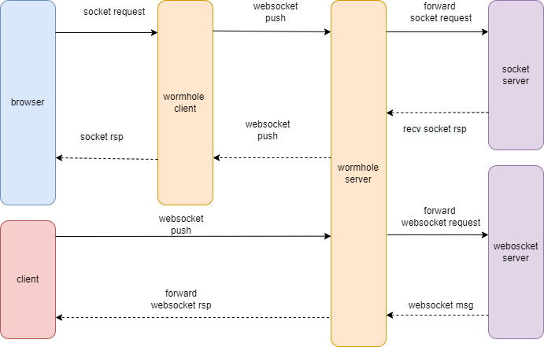

# wormhole
## Overview
wormhole is a bridge program, It forwards the data to the server through websocket, Then the server forwards the data to the target server,It is based on boost.asio and cpp20 coroutine

## how to build?
```
mkdir build && cd build
cmake ..
make -j 9
```
## how to start?
```
./wormhole_client --config=../cfg/wormhole_client.yaml
./wormhole_server --config=../cfg/wormhole_server.yaml
```

## data flow chart
